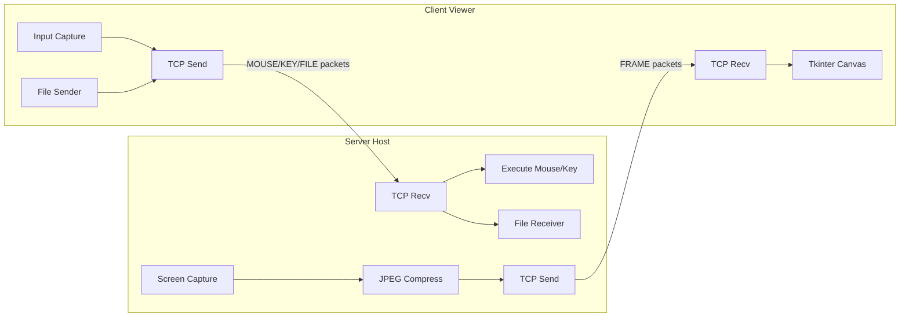

# RDP Simulation — Implementation Plan

A simplified Remote Desktop system over LAN demonstrating client-server architecture, custom application-layer protocol, TCP communication, and real-time screen + input control.

---

## Architecture Overview



---

## Custom Protocol (TYPE-LENGTH-DATA)

Every message on the wire follows this binary format:

| Field | Size | Description |
|-------|------|-------------|
| TYPE  | 1 byte | Message type enum (0x01–0x06) |
| LENGTH | 4 bytes (big-endian uint32) | Length of DATA payload |
| DATA  | LENGTH bytes | Payload (JSON or raw bytes) |

### Message Types

| Code | Name | Direction | DATA Format |
|------|------|-----------|-------------|
| 0x01 | FRAME | Server → Client | Raw JPEG bytes |
| 0x02 | MOUSE | Client → Server | JSON: `{"event","x","y","button","dx","dy"}` |
| 0x03 | KEY | Client → Server | JSON: `{"event","key"}` |
| 0x04 | FILE_META | Sender → Receiver | JSON: `{"filename","filesize","direction"}` |
| 0x05 | FILE_CHUNK | Sender → Receiver | Raw file bytes (up to 64 KB) |
| 0x06 | FILE_DONE | Sender → Receiver | Empty (signals completion) |

---

## Proposed Code Structure

```
CN-project/
├── protocol/
│   ├── __init__.py
│   └── protocol.py        # Message types, pack/unpack, send_message, recv_message
├── networking/
│   ├── __init__.py
│   └── connection.py       # Socket wrapper: connect, accept, close, reliable send/recv
├── server/
│   ├── __init__.py
│   ├── screen_capture.py   # Screen grab + JPEG compress (mss + Pillow)
│   ├── input_handler.py    # Execute mouse/key events (pynput)
│   ├── file_handler.py     # Receive/send files
│   └── server_app.py       # Server GUI (Tkinter) + main server loop
├── client/
│   ├── __init__.py
│   ├── screen_viewer.py    # Render frames on Tkinter canvas
│   ├── input_capture.py    # Capture mouse/key in viewer window
│   ├── file_handler.py     # Send/receive files
│   └── client_app.py       # Client GUI (Tkinter) + main client loop
├── utils/
│   ├── __init__.py
│   └── helpers.py          # Logging, IP discovery, common utilities
├── run_server.py           # Entry point for server
├── run_client.py           # Entry point for client
├── requirements.txt
├── PROMPT.md
└── README.md               # Updated with run + packaging instructions
```

---

## Proposed Changes

### Protocol Module

#### [NEW] [protocol.py](file:///c:/Users/Parth%20Gupta/Desktop/CN-project/protocol/protocol.py)

- Define `MessageType` enum (FRAME=0x01, MOUSE=0x02, KEY=0x03, FILE_META=0x04, FILE_CHUNK=0x05, FILE_DONE=0x06)
- `pack_message(msg_type, data: bytes) -> bytes` — prepend 1-byte type + 4-byte length header
- `send_message(sock, msg_type, data)` — pack + sendall
- `recv_message(sock) -> (msg_type, data)` — read header, then payload; handle partial reads
- All protocol logic isolated here for clean viva explanation

---

### Networking Module

#### [NEW] [connection.py](file:///c:/Users/Parth%20Gupta/Desktop/CN-project/networking/connection.py)

- `create_server(host, port) -> server_socket` — bind, listen
- `accept_client(server_socket) -> (conn, addr)` — accept
- `connect_to_server(host, port) -> socket` — connect
- `close_connection(sock)` — safe shutdown + close
- `recv_exact(sock, n)` — reliably read exactly n bytes (handles partial TCP reads)

---

### Server Module

#### [NEW] [screen_capture.py](file:///c:/Users/Parth%20Gupta/Desktop/CN-project/server/screen_capture.py)

- Use `mss` to grab primary monitor
- Compress to JPEG (quality ~50) using Pillow
- Return raw JPEG bytes
- Configurable FPS (default 10)

#### [NEW] [input_handler.py](file:///c:/Users/Parth%20Gupta/Desktop/CN-project/server/input_handler.py)

- Use `pynput.mouse.Controller` and `pynput.keyboard.Controller`
- `handle_mouse(data_json)` — move, click, scroll
- `handle_key(data_json)` — press/release keys
- Scale coordinates from client resolution to server resolution

#### [NEW] [file_handler.py](file:///c:/Users/Parth%20Gupta/Desktop/CN-project/server/file_handler.py)

- `receive_file(sock, save_dir)` — receive FILE_META, then FILE_CHUNK stream, write to disk
- `send_file(sock, filepath)` — send FILE_META + FILE_CHUNKs + FILE_DONE

#### [NEW] [server_app.py](file:///c:/Users/Parth%20Gupta/Desktop/CN-project/server/server_app.py)

- Tkinter GUI showing: local IP, port (editable), status label, Start/Stop button, "Send File" button, log area
- On start: bind server socket in background thread, wait for client
- On connect: spawn threads for screen streaming (send) and command receiving (recv)
- On disconnect: reset to waiting state
- On stop: close socket, reset UI

---

### Client Module

#### [NEW] [screen_viewer.py](file:///c:/Users/Parth%20Gupta/Desktop/CN-project/client/screen_viewer.py)

- Tkinter `Canvas` widget to display frames
- `update_frame(jpeg_bytes)` — decode JPEG → PhotoImage → canvas.itemconfig
- Auto-scale frames to fit window

#### [NEW] [input_capture.py](file:///c:/Users/Parth%20Gupta/Desktop/CN-project/client/input_capture.py)

- Bind mouse events (move, click, scroll) on the canvas
- Bind keyboard events on the root window
- Serialize to JSON and send via protocol
- Coordinate mapping: canvas coords → server screen coords (using frame aspect ratio)

#### [NEW] [file_handler.py](file:///c:/Users/Parth%20Gupta/Desktop/CN-project/client/file_handler.py)

- Same file transfer logic as server's file_handler but from client perspective
- `send_file(sock, filepath)` / `receive_file(sock, save_dir)`

#### [NEW] [client_app.py](file:///c:/Users/Parth%20Gupta/Desktop/CN-project/client/client_app.py)

- Tkinter GUI: IP input, port input, Connect/Disconnect button, "Send File" button, remote screen canvas, status bar
- On connect: spawn thread to receive frames + process input events
- Mouse/keyboard capture active only when canvas has focus
- File transfer via dialog

---

### Utils Module

#### [NEW] [helpers.py](file:///c:/Users/Parth%20Gupta/Desktop/CN-project/utils/helpers.py)

- `get_local_ip()` — detect LAN IP
- Simple logger setup
- Constants (default port, FPS, JPEG quality, chunk size)

---

### Entry Points

#### [NEW] [run_server.py](file:///c:/Users/Parth%20Gupta/Desktop/CN-project/run_server.py)
#### [NEW] [run_client.py](file:///c:/Users/Parth%20Gupta/Desktop/CN-project/run_client.py)

Simple entry scripts that import and launch the respective GUI apps.

---

### Dependencies

#### [NEW] [requirements.txt](file:///c:/Users/Parth%20Gupta/Desktop/CN-project/requirements.txt)

```
mss
Pillow
pynput
pyinstaller
```

> [!NOTE]
> `tkinter`, `socket`, `threading`, `struct`, `json`, `io`, `os` are all stdlib — no extra installs needed.

---

### README Update

#### [MODIFY] [README.md](file:///c:/Users/Parth%20Gupta/Desktop/CN-project/README.md)

Full rewrite with:
- Project overview
- Protocol specification
- How to run (Python)
- How to package as .exe (PyInstaller commands)
- Viva talking points (TCP usage, protocol design, data flow)

---

## Key Design Decisions

1. **Tkinter over PyQt** — Zero extra dependencies, ships with Python, simpler for a lab project
2. **JPEG compression** — Best balance of quality/size for real-time streaming; quality ~50 keeps frames ~30-80 KB
3. **Threading model** — One thread for screen capture/send, one for receiving commands; avoids asyncio complexity
4. **pynput** — Works for both mouse and keyboard, cross-platform, simpler than pyautogui for event-level control
5. **Binary protocol** — 5-byte header (1 type + 4 length) is trivially parseable and easy to explain in viva

---

## Verification Plan

### Automated Tests
- Run `python run_server.py` and `python run_client.py` on the same machine (localhost)  
- Verify connection establishment
- Verify frames render on client
- Verify mouse/keyboard events round-trip

### Manual Verification
- Test file transfer in both directions
- Test disconnect/reconnect behavior
- Verify PyInstaller packaging with: `pyinstaller --onefile --windowed run_server.py` and `pyinstaller --onefile --windowed run_client.py`

### Build Verification
```powershell
pip install -r requirements.txt
python run_server.py   # Should open server GUI
python run_client.py   # Should open client GUI
```
